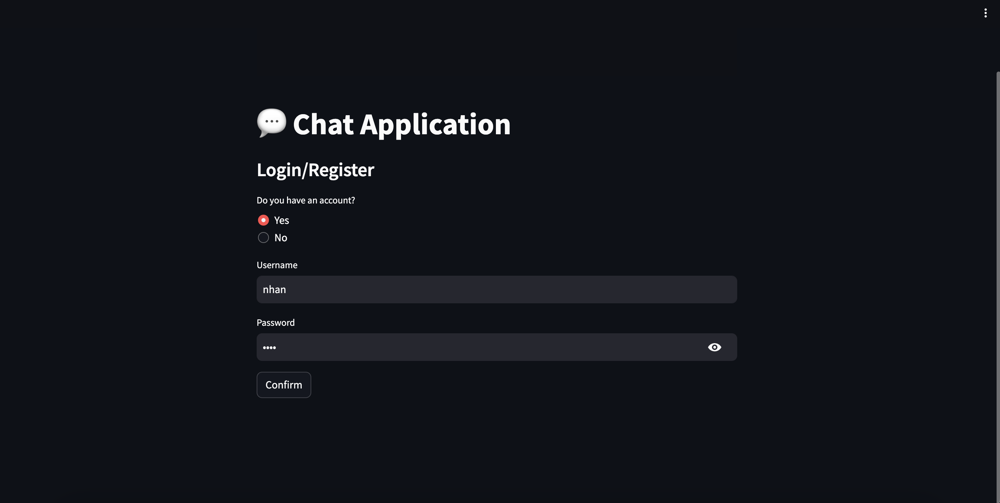
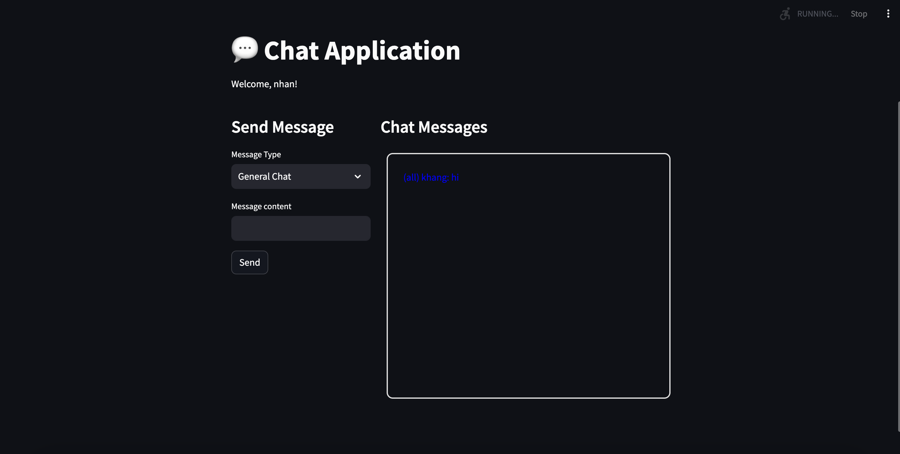

# Chat Socket Application

A real-time chat application built with Python, featuring a Streamlit frontend and a WebSocket server.

## Prerequisites

- Python 3.x
- pip (Python package manager)
- Virtual environment (automatically created by the scripts)

## Project Structure

```
.
├── README.md
├── requirements.txt
├── server.sh
├── client.sh
├── frontend.py
└── server.py
```

## Setup and Installation

1. Clone the repository:
```bash
git clone https://github.com/DarkMacician/CS440V
cd CS440V
```

2. The application uses two main scripts:
   - `server.sh`: Runs the WebSocket server
   - `client.sh`: Runs the Streamlit frontend

## Running the Application

### Start the Server

```bash
./server.sh
```

This will:
- Create a virtual environment if it doesn't exist
- Install required dependencies
- Start the WebSocket server

### Start the Client

```bash
./client.sh
```

This will:
- Create a virtual environment if it doesn't exist
- Install required dependencies
- Start the Streamlit frontend with auto-reload enabled

## Features

- Real-time chat functionality
- Auto-reloading frontend
- Clean process management and shutdown
- Virtual environment isolation

## User guides
### Step 1: Connect to server
- Open the application in your browser.
- Click the Connect to server button.


### Step 2: Login or Register
- Choose whether you already have an account:
   - Yes: Enter your username and password to log in.
   - No: Enter a new username and password to register.
- Click Confirm




## Step 3: Main Chat Interface
After logging in, you’ll see the main chat screen with these options:
1. General Chat
- Message Type: Choose between:
   - General Chat (public to all users)
   - Private Message (to a specific user)
   - Group Message (to a group)
- Message Content: Type your message and click Send.


Other users will see this public message.



2. Private Messages
- Select Private Message.
- Enter the recipient’s username.
- Type your message and send.


3. Group Messages
- Select Group Message.
- Choose an action:
   - Create Group: Enter a group name and click Create.
   - Join Group: Enter the group name and click Join.
   - Send Group Message: Enter the group name and your message, then click Send.


Enter a group name and click Create.


Enter the group name and click Join.


Enter the group name and your message, then click Send


## Stopping the Application

- Press `Ctrl+C` in the terminal where the scripts are running
- The scripts will automatically clean up processes and deactivate the virtual environment

## Notes

- The client runs in headless mode with auto-reload enabled
- Both scripts handle their own virtual environment management
- The application uses WebSocket for real-time communication 

